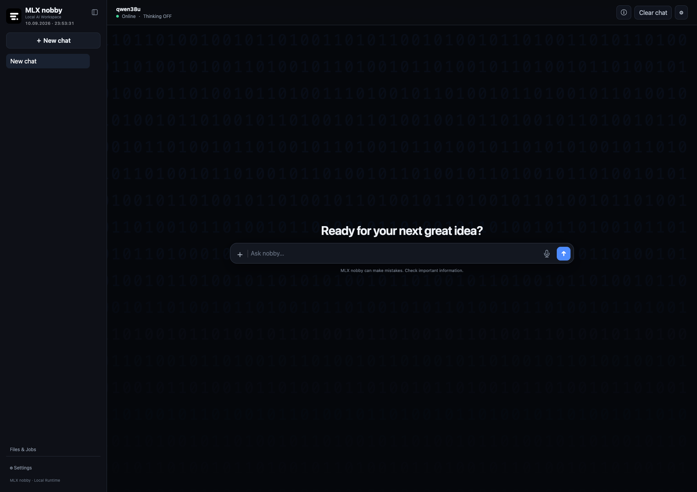
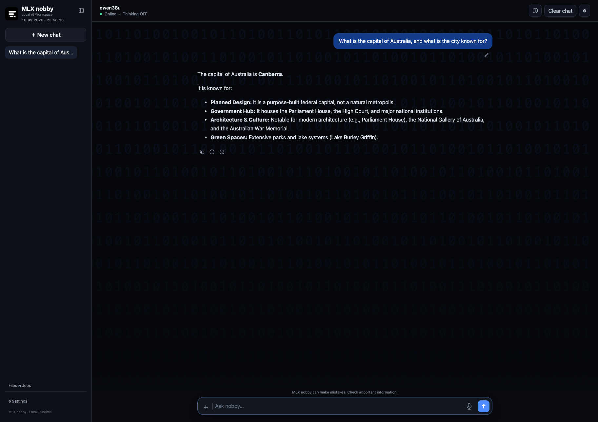
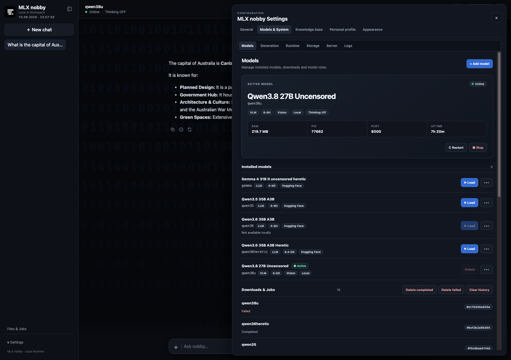
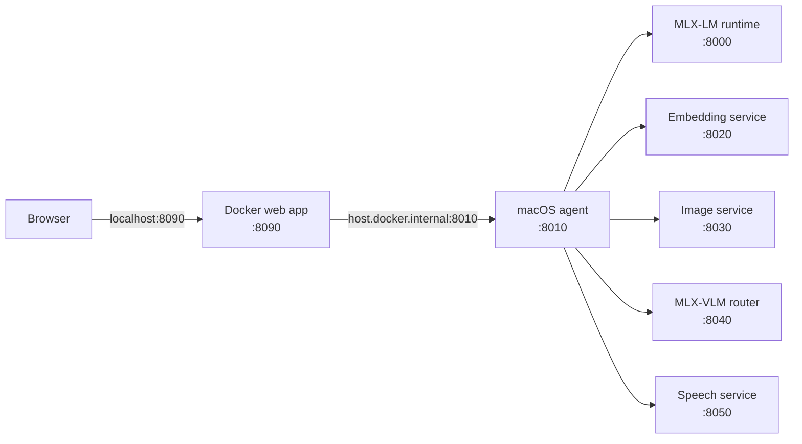

# MLX nobby


**MLX nobby** is an open-source local AI assistant and control center for Apple Silicon, built around Apple's MLX ecosystem. It brings local LLM chat, model management, RAG, coding workflows, image generation, speech transcription, and AI agents together in a single browser-based interface for macOS.

Run LLMs and AI services locally on your Mac with MLX and Metal acceleration while keeping models, conversations, documents, embeddings, and generated content under your control.

Native inference services run directly on macOS for efficient Apple Silicon acceleration. Only the web application runs in Docker, with a loopback-only local agent providing a controlled bridge between the container and host resources.

## Features

- Local LLM chat with streaming, model switching, thinking controls, and saved
  conversations
- Model aliases, Hugging Face downloads, cache inspection, and background jobs
- Coding workspaces with bounded file search, reviewable patches, and test runs
- Diagnostic, research, and file-processing agents using the central AgentRuntime
  with workspace-bound tools, permission checks, and approval/resume
- Role-based local model selection for chat, agent, coding, vision, image, and
  Qwen3 embeddings served through MLX-Serve
- Local embeddings, knowledge sources, and retrieval-augmented generation (RAG)
- Hierarchical semantic routing for chat, multimodal, research, coding, and
  creative requests
- MLX-VLM routing for multimodal requests
- Speech-to-text through the native MLX Audio service
- Local text-to-speech with Serena voice and pause/resume playback in chat
- Qwen Image 2.1 generation through MLX-Serve, Qwen image editing, optional
  DiffusionKit/MFLUX/SDXL providers, and Real-ESRGAN upscaling
- Local LTX 2.5 text-to-video and image-to-video generation with preview,
  format selection, and model-aware media quality profiles
- Coordinated chat, image, and video runtimes with automatic resource handoff
- Asynchronous image jobs with real progress, cancellation, reload recovery,
  and persistent chat artifacts
- Iterative image editing that continues from the active image artifact
- Per-chat generation settings whose changes automatically become defaults for
  newly created chats
- System metrics, service health, logs, and runtime controls
- English and German chat UI with a persisted language setting
- Optional `vision_uncensored` model role selected for confidently classified
  adult images; ordinary and unclassified images use the `vision` role

## Screenshots

### Start screen



### Local AI chat



### Model management



## Architecture



| Port | Component | Runs in | Default exposure |
| ---: | --- | --- | --- |
| 8000 | MLX-LM runtime | macOS | `127.0.0.1` |
| 8010 | Host agent and API bridge | macOS | `127.0.0.1` |
| 8020 | Embedding service | macOS | `127.0.0.1` |
| 8030 | Image service | macOS | `127.0.0.1` |
| 8040 | MLX-VLM router | macOS | `127.0.0.1` |
| 8050 | Speech service | macOS | `127.0.0.1` |
| 8090 | Web application | Docker | `127.0.0.1` |

MLX must remain native. Moving MLX into the Docker image would remove the
intended Apple Silicon runtime path.

## Requirements

- macOS on Apple Silicon (`arm64`)
- Python 3.13 and Python 3.11
- Docker with Docker Compose for the web application
- FFmpeg for speech input conversion
- Node.js when running the JavaScript checks
- Local model weights; the repository does not include models

Homebrew is optional, but is the simplest way to install the required Python
interpreters, Docker tooling, and FFmpeg.

## Quick start

Clone the repository and run the installer:

```sh
git clone https://github.com/nfekete82/mlx-nobby.git
cd mlx-nobby
./scripts/install.sh
```

After installation, open:

```text
http://127.0.0.1:8090
```

MLX nobby does not download an LLM automatically. Add or select a local
MLX-compatible model before starting your first chat.

The installer validates macOS and Apple Silicon, creates or updates the five
isolated service environments, links `~/bin/mlx` to the repository-managed
`scripts/mlx`, creates a minimal local runtime configuration if none exists,
and starts the Docker web application.
Existing MLX configuration and model aliases are preserved. LaunchAgent files
are installed only when the configured router model directory exists.

Useful installer variants are:

```sh
./scripts/install.sh --no-docker
./scripts/install.sh --no-launchd
./scripts/install.sh --no-python
./scripts/install.sh --no-launchd --no-docker
```

The last form is useful when you only want to install the manager and validate
an existing setup. `--no-python` expects compatible service environments to
already exist.

Add `~/bin` to `PATH` if the installer reports that it is missing:

```sh
export PATH="$HOME/bin:$PATH"
```

Set `MODEL` in `~/.config/mlx-server/config` to a local model path or an alias
defined in `~/.config/mlx-server/models`. The generated configuration starts
with an empty `MODEL`, port 8000, and thinking disabled so an incomplete first
install cannot silently select a model.

You can manage local models from the MLX nobby model interface or configure
aliases manually in:

    ~/.config/mlx-server/models

The router defaults to
`~/Models/router/Qwen3.5-4B-MLX-4bit`. To use another local router model,
install the LaunchAgents after setting its path:

```sh
MLX_ROUTER_MODEL_PATH=/absolute/path/to/router/model \
  ./scripts/install-launchd.sh
mlx restart-all
```

Then open <http://127.0.0.1:8090>. The web container reaches the native agent
through `host.docker.internal`; it does not contain the MLX runtimes.

## MLX manager

The maintained manager source is `scripts/mlx`; the installer creates
`~/bin/mlx` as a symbolic link to that repository file. This means future
`git pull` updates automatically apply to the `mlx` command without rerunning
the installer. Common commands include:

```sh
mlx status
mlx services
mlx doctor
mlx start
mlx stop
mlx restart
mlx restart-all
mlx reset
mlx models
mlx model <alias-or-huggingface-repository>
mlx model add <alias> <repository-or-local-path>
mlx download <alias-or-repository>
mlx cache
mlx thinking on
mlx thinking off
mlx chat
mlx ask "Your question"
```

Commands that download a Hugging Face repository require network access and
may require local Hugging Face authentication for gated models. Never put an
access token in the tracked model alias file.

## Service environments

The Python environments are intentionally separate. DiffusionKit requires a
legacy MLX combination that is incompatible with the current runtime stack.
Do not merge these requirements into one environment.

| Environment | Python | Requirements |
| --- | --- | --- |
| `agent-venv` | 3.13 | `requirements/agent.txt` |
| `runtime-venv` | 3.13 | `requirements/runtime.txt` |
| `embedding-venv` | 3.11 | `requirements/embeddings.txt` |
| `image-venv` | 3.11 | `requirements/images.txt` |
| `speech-venv` | 3.13 | `requirements/speech.txt` |

See [Dependency setup](docs/DEPENDENCIES.md) for manual installation,
constraints, tested versions, optional MFLUX and vision classifier setup, and
offline import checks.

## Configuration

Copy `.env.example` to `.env` only when you need to override the Docker web
defaults:

```sh
cp .env.example .env
```

The web container uses `AGENT_URL`, `MLX_WEB_PORT`, and upload/host limits from
Compose. Native services do not automatically read this file. Their environment
variables and ownership are documented in `.env.example` and
`docs/DEPENDENCIES.md`.

Local configuration belongs in:

- `~/.config/mlx-server/config` for the runtime model and server settings
- `~/.config/mlx-server/models` for model aliases
- `~/.config/mlx-web/` for rendered service configuration and logs
- local ignored `.env` files for Docker overrides

Do not commit tokens, credentials, personal paths, model weights, local
databases, generated media, or configuration copied from your machine.

Generation parameters such as system prompt, preset, temperature, and maximum
token count belong to the active chat. Changes are persisted automatically as
defaults for newly created chats.

For frontend development, `./scripts/dev-web.sh` starts the Compose web
container with a read-only live mount of `frontend/`. Changes to those files
then appear without rebuilding the container.

## RAG and embeddings

Knowledge sources are indexed by the native agent through the embedding service
on port 8020. The API supports single and batched embeddings and keeps the
contract used by `agent/knowledge.py`. Source data, generated indexes, and local
knowledge directories are runtime data and are ignored by Git.

Embedding packages may contact Hugging Face when a referenced model is not
already cached. Use local model paths and the offline variables documented in
`docs/DEPENDENCIES.md` when network-free behavior is required.

## Images and speech

The image service supports the repository's DiffusionKit provider and an
optional, separately installed MFLUX CLI. An opt-in SDXL provider uses a local
checkpoint, and optional Real-ESRGAN presets upscale images. Image model
weights and generated outputs remain local. MFLUX and Real-ESRGAN are not
installed by the default installer.

Image generation and image editing use asynchronous jobs with explicit
`queued`, `loading`, `running`, `saving`, `completed`, `failed`, and
`cancelled` states.

The chat UI displays provider-reported progress without inventing intermediate
steps. Active jobs can be cancelled and are automatically resumed when the
browser is reloaded. The server remains the source of truth for recovered job
state.

Completed images are stored as chat artifacts. Qwen Image Edit supports
iterative editing from the active image artifact of the current session, so a
generated or edited image can be refined in subsequent prompts without
re-uploading it.

The speech service uses `mlx-audio[stt,tts]` and FFmpeg. Uploaded audio is relayed
through the web application and host agent to the loopback-only speech service.
Chat messages can also be read aloud with the local Qwen3 TTS model and Serena
voice; playback can be paused and resumed.

See `IMAGE_RUNTIME.md` and `docs/DEPENDENCIES.md` for provider and runtime
details.

## Language settings

The chat interface defaults to English on a new browser profile. English and
German are selectable in Settings, and the choice is stored in browser local
storage. The `concise-de` preset deliberately instructs the model to answer in
German and is not an untranslated interface string.

Run the translation audit with:

```sh
git ls-files -z '*.py' | xargs -0 test-venv/bin/python -m py_compile
git ls-files -z '*.json' | xargs -0 -n1 python3 -m json.tool >/dev/null
python3 scripts/i18n-audit.py
```

## Privacy and network behavior

Model inference, saved chats, notes, knowledge indexes, generated images, and
service logs are designed to remain on the local machine. The services bind to
loopback by default and the web port is published on localhost.

MLX nobby is not completely offline by default:

- Model download and cache actions can contact Hugging Face.
- The optional vision classifier downloads its ONNX model from Hugging Face on
  first use unless it is already cached or a local model path is configured.
- The local text-to-speech model can also download weights on first use.
- Research actions can query the configured SearXNG instance and fetch selected
  external pages.
- The current web pages load Tailwind CSS, Marked, DOMPurify, and Highlight.js
  assets from public CDNs.
- Docker builds and Python package installation contact their configured
  registries.

If those connections are unacceptable, place models and packages in local
caches, configure research accordingly, and vendor or block the CDN assets
before use. Review browser developer tools or network controls for the exact
behavior of your deployment.

## Security

The supplied configuration is intended for a trusted, single-user machine.
Native services and the Docker port are loopback-bound; request sizes, hosts,
origins, model references, and proxy routes are validated. Coding and knowledge
features can access explicitly configured local workspaces.

There is no authentication layer suitable for public exposure. Do not bind the
services to a LAN or the internet without adding authentication, TLS, and network
isolation. See [SECURITY.md](SECURITY.md) for reporting and operating guidance.

## Development and tests

Install the CPU-only test environment and run the local checks:

```sh
python3.13 -m venv test-venv
test-venv/bin/python -m pip install -r requirements/test.txt
test-venv/bin/python -m pytest -q
python3 scripts/i18n-audit.py
find frontend -name '*.js' -print0 | xargs -0 -n1 node --check
for test in tests/*.mjs; do node "$test" || exit 1; done
bash -n scripts/install.sh scripts/install-launchd.sh scripts/doctor.sh \
  scripts/mlx scripts/mlx-server-start
docker compose config
git diff --check
```

The test manifest contains no MLX packages and downloads no models. Native MLX
imports require Apple Silicon and Metal and are documented separately.

## Contributing

Please read [CONTRIBUTING.md](CONTRIBUTING.md). Keep changes focused, preserve
the native-service boundary, add tests for behavior changes, and exclude local
runtime data from pull requests.

## Project status

MLX nobby is under active development. Configuration and APIs may change, and
the image stack includes a deliberately isolated legacy dependency. The project
has not been presented here as production-ready or independently security
audited.

## License

Released under the [MIT License](LICENSE).
