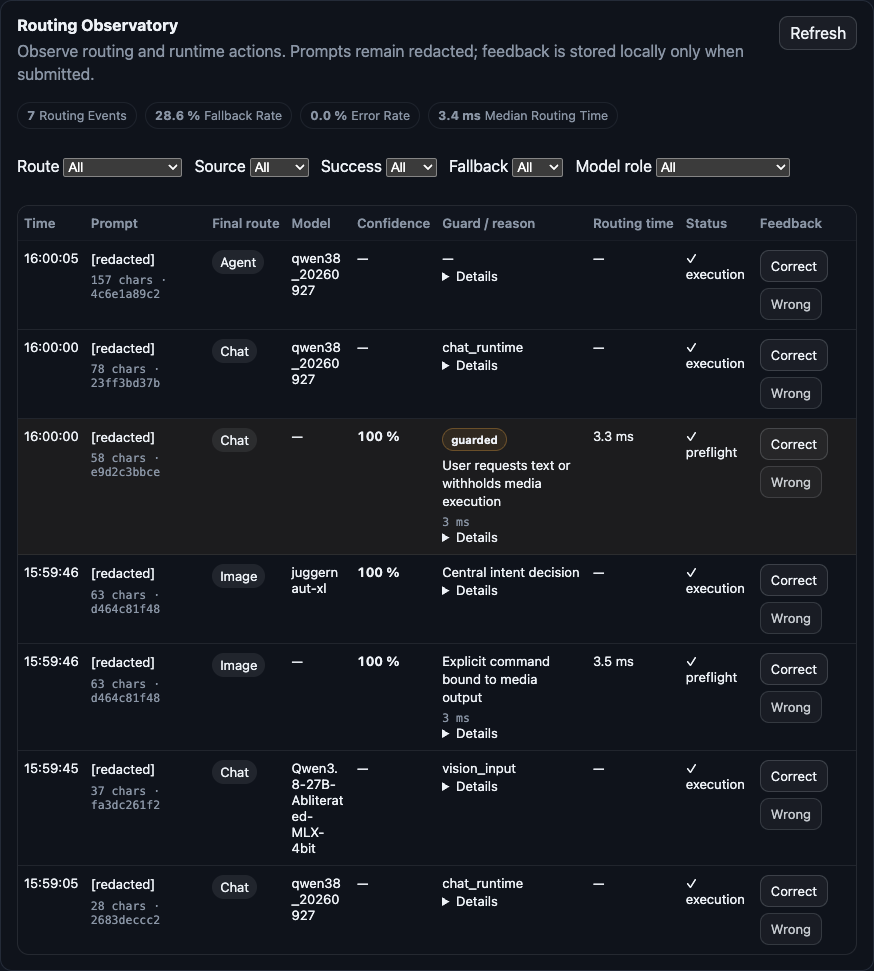

# Routing Observatory

Open **Settings → Tools → Routing Observatory** to inspect decisions and runtime
actions. The observatory is passive: it does not select models, authorize tools,
change routing rules or remove guards.

## Architecture and instrumented paths

`backend/routing_observatory.py` owns a thread-safe, process-local ring buffer of
500 events. Snapshots are copies; retention automatically evicts oldest entries.
Normal observations perform no disk writes and make no additional runtime calls.

Two central hooks cover the web flow:

- The existing `MediaRoutingUiMiddleware` records the final guarded response of
  `/api/mlx/chat/actions/route`, once per preflight. Failed HTTP preflights also
  produce error events. The shared `backend/media_intent.py` decision remains
  authoritative. Its guard is observed, not reimplemented.
- `RoutingObservationMiddleware` observes `/api/chat/stream`,
  `/api/chat/reliable-stream`, `/api/mlx/chat/actions`, `/api/mlx/agent/run`,
  `/api/mlx/chat/files/route`, `/api/mlx/images/generate`, `/api/image/generate`
  and `/api/mlx/video/jobs`. It consumes returned routing metadata and existing
  model metrics. It forwards SSE chunks immediately, with bounded frame parsing.

`agent/app.py` uses the existing `observed_turn` decorator on action preflight,
so semantic prompt-router model metrics can reach the web observation. Runtime
model roles/aliases and queue waits come from existing `ModelCallMetrics`,
including vision metrics. The existing vision-route result is observed at the
web gateway; selection of the fallback `vision` role is marked explicitly. Router models are identified separately from execution
models; an image prompt optimizer is not presented as the image generator.

Existing browser requests to `/api/mlx/image-jobs/{id}` and
`/api/mlx/video-jobs/{id}` enrich retained dispatch events with the actual model,
queue wait and final job outcome. The observatory adds no job polling.
Scheduled recovery in the reliable chat gateway marks the current event through
a `ContextVar`, including across `asyncio.to_thread`, without altering SSE output.

Preflight and execution are separate observations, not duplicate logs of the
same decision. `phase` distinguishes `preflight`, `dispatch` and `execution`.
A successful dispatch means job acceptance; only a returned terminal job state
confirms generation completion. Request tracing reuses valid existing trace IDs
when available. It does not manufacture a relationship between separate browser
requests that did not supply a shared trace ID.

## Event schema

| Field | Meaning |
| --- | --- |
| `id`, `timestamp` | Observation UUID and Unix seconds. |
| `request_id` | Existing validated trace/correlation ID, or generated UUID. |
| `source` | `chat`, `vision`, `media`, `agent`, `image`, `video` or `router`. |
| `phase` | Preflight decision, accepted dispatch, or execution. |
| `selected_route`, `selected_tool` | Final route and tool when returned. |
| `selected_model_role`, `model`, `router_model` | Observed role/model alias or identifier; router model separately. |
| `confidence`, `decision_reason` | Available decision confidence and safe rule/method code. |
| `guards`, `intent_signals` | Applied guard codes and detected intent names. |
| `fallback`, `fallback_reason` | Router fallback or scheduled runtime recovery. Guard presence alone does not set the flag; existing fallback metadata does. |
| `attachment_types`, `attachment_count`, `vision` | Content-free context metadata. |
| `prompt_hash`, `prompt_length`, `prompt_preview` | SHA-256, character count, and always `[redacted]`. |
| `latency_ms` | `routing`, `runtime_wait`, `first_semantic_output`, `total`, in milliseconds or null. |
| `success`, `error_code` | Known request/job outcome and content-free error classification. |
| `job_id` | Job correlation when a job response supplies it. |

Legacy names (`target`, `reason`, `created_at`, `prompt_sha256`, `prompt_chars`,
`duration_ms`) remain available for existing consumers. Confidence of the central
media rule describes rule certainty, not calibrated LLM probability. Unknown
values remain null. Execution total time is never substituted for routing time.
First semantic output measures the first content SSE frame, not a heartbeat,
reasoning token or upstream connection. Request-to-output time can include queue
and prefill. Job queue time comes from supplied job timestamps.

## Privacy and retention

Events retain no full prompt, preview text, attachment filenames, paths, URLs,
image bytes, conversation history, assistant output or raw exception messages.
Model paths use the existing safe metadata helper (basename only). Arbitrary
model-generated decision explanations are omitted in favor of rule/method codes.
Conversation/session identifiers are not copied into events.

Request JSON is parsed transiently to hash the current prompt and classify
attachments, with a 16 MiB capture cap. Oversized/unparseable input records
`metadata_unavailable`, not a partial prompt. Response JSON capture is capped at
1 MiB and SSE frames at 64 KiB; oversized diagnostic frames are ignored while
the original response continues unchanged. Buffers are released after parsing.

Events disappear on process restart. Each web worker has its own independent
buffer; deployments needing aggregated diagnostics require a future shared
observability transport. Diagnostic routes use the existing web namespace and
its deployment access controls; no new authorization system is introduced.

## API

- `GET /api/routing/events`: `{events, max_retained}`, newest first.
- `GET /api/routing/stats`: retained total, route/model-role distributions,
  fallback/error rates, mean routing latency, p50/p95, and top decision reasons.
- `DELETE /api/routing/events`: clears the process-local buffer.

Both GET endpoints accept `route`, `source`, `success`, `fallback`, `model_role`.
Events additionally accept `limit`, clamped to 1–500 (default 50).
Boolean filters use `true`/`false`. Stats cover all matching retained events,
independent of the table's limit. Latency calculations exclude unknown values;
p95 uses the nearest rank. Error rate excludes unknown outcomes and reports its
known-outcome count. Rates are fractions between zero and one.

```sh
curl 'http://127.0.0.1:8090/api/routing/events?source=vision&limit=20'
curl 'http://127.0.0.1:8090/api/routing/stats?fallback=true'
curl -X DELETE 'http://127.0.0.1:8090/api/routing/events'
```

`GET /api/routing/decisions` is a compatibility alias for the in-memory history.
Existing `/api/routing/decisions/{id}/feedback` and `/api/routing/regressions`
remain available.

## UI, performance and feedback

The Tools card shows event count, fallback/error rates, median routing time,
filters and a table with time, redacted prompt/hash, final route, model,
confidence, reason, duration and outcome/phase. Expand details for guards,
intent, attachments, fallback, original route, timing, model and request ID.

Only a visible Tools pane in an open settings panel and an active browser tab
fetches routing data. It loads at most one event/stats pair per ten seconds;
manual refresh and filter changes are supported. Concurrent refreshes are
coalesced, visibility changes are throttled, and closing the view cancels its
timer. There is no routing polling during idle. Translation/asset loading is
independent of diagnostic data loading. Existing runtime contention fixes and
vision heartbeat/recovery behavior remain unchanged.

Correct/Wrong feedback uses the already existing local JSON store, configured
by `MLX_ROUTING_OBSERVATORY_FILE` (default
`~/.config/mlx-web/routing-observatory.json`). Only explicitly submitted feedback
copies the safe event into this bounded store. Normal events are not persisted.
Legacy historical previews are redacted on read and subsequent feedback writes.
Clearing events does not delete stored feedback. An evicted event cannot receive
new feedback unless it was already saved. Feedback never changes routing rules.
A future learning workflow could export reviewed metadata, link regression tests
and propose separately reviewed rule changes. No automatic learning is present.

## Limits and validation

This version observes web entrypoints; calls made directly to Agent/service APIs
outside the web process are not collected. Nested agent tool choices are not
separate routing events. Job outcomes/models become available only when existing
clients request progress. A configured `auto` model is not an actual model
identifier. Missing metrics, expired job correlations and oversized frames leave
fields unknown. No latency is inferred from unavailable instrumentation.

Regression coverage includes chat, vision, explicit media, image/LTX prompt
requests, attachment context, fallback/recovery, prompt privacy, bounded
concurrent retention, API filters/stats/clear, job progress enrichment, feedback
persistence, immediate SSE delivery and visible-only/coalesced UI requests.
The existing routing and runtime reliability suites remain applicable.

### Live validation (2026-10-01)

A separate web process from this branch was tested in headless Chrome against
the existing local Agent and native services. Browser requests used the same
production endpoints; the diagnostics navigation was exercised through the UI.
No configured model roles were changed.

| Scenario | Observed route / role | Actual action |
| --- | --- | --- |
| Normal text chat | `chat` / `chat` (`qwen38_20260927`) | Content SSE completed. |
| Image description (synthetic image fixture) | `chat` / `vision_uncensored` | VLM content SSE completed; image context recorded. |
| Explicit image request | `image` / `image` (`juggernaut-xl`) | Job accepted and completed; existing job-status reads updated its event. |
| LTX 2.5 prompt request | Preflight `chat`, execution `chat` / `chat` | Text answer completed; no video/image dispatch. |
| Read-only diagnostic agent task | `agent` / `agent` (`qwen38_20260927`) | Agent task completed. |

The browser also verified zero routing data requests while settings were closed,
exactly one events/stats pair when Tools opened, no overlap after repeated refresh
notifications, and no polling after closing the view. Python: 1,204 passed plus
298 subtests; JavaScript: 126 passed. The full Python run required an unrestricted
execution environment because a pre-existing workspace test launches a subprocess.

The initial image test used `preview`, which the local image pipeline rejected.
With supported quality `fast`, generation completed. The observatory correctly
reported the earlier failure as well; routing behavior was unchanged.


